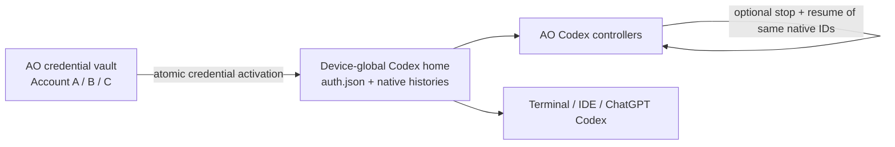
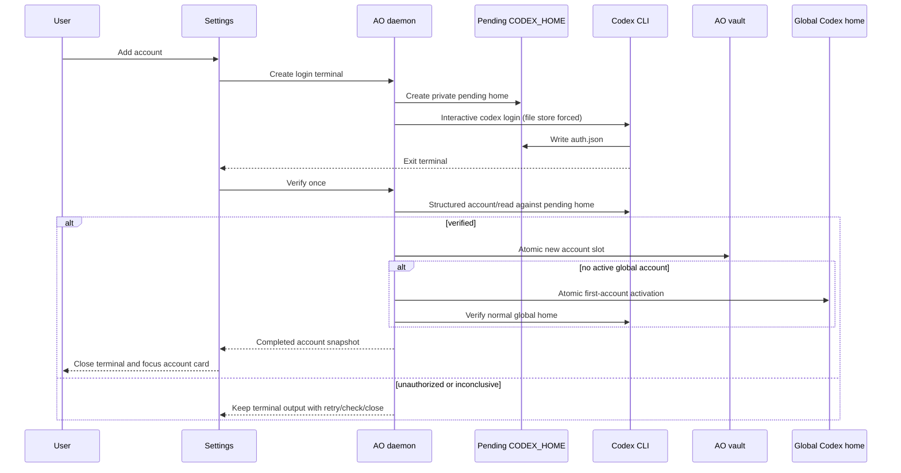
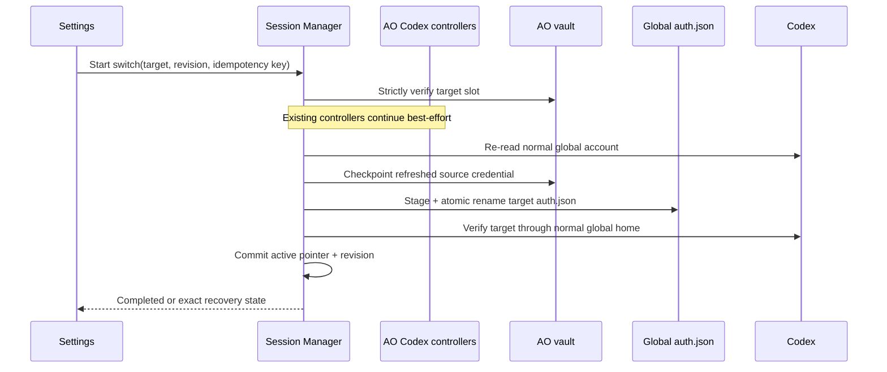

# Codex Account Management and Device-Global Switching

Status: current implementation architecture for Codex account management.

## Objective

AO keeps multiple verified Codex credentials in a private vault while using the same effective Codex home as the Codex CLI, IDE integrations, and ChatGPT:

```text
$CODEX_HOME
or
~/.codex
```

Exactly one vault account may correspond to the device-global credential at a time. Changing that account is an explicit global credential transaction. By default AO leaves its running Codex controllers untouched; users may opt into stopping and resuming the AO-owned controllers. Other Codex clients remain outside AO's process-control boundary in either mode.



## Boundaries

- Codex owns the credential format. AO treats every `auth.json` as opaque bytes.
- Codex owns native history under the effective global home. AO never moves or copies it.
- Phase 1 remains the installation and launch-readiness authority.
- AO account metadata and credentials remain filesystem-owned; SQLite stores only the active pointer and switch journal.
- File-backed global credentials are required for switching. Keyring-backed or unsafe credentials continue to work normally in Codex but cannot be switched by AO.
- Account email and authentication method are display metadata, not identity. Duplicate emails are valid.

## Filesystem layout

```text
<AO_DATA_ROOT>/harnesses/codex/
├── accounts/<account-uuid>/
│   ├── account.json
│   └── credential-home/auth.json
├── pending-accounts/<operation-uuid>/
└── switch-staging/<switch-uuid>/
```

Account directories use mode `0700`; descriptors and credentials use `0600`. AO rejects symlinks, traversal, unsafe ownership, non-regular files, and hard-linked credentials. Writes use sibling temporary files, `fsync`, and atomic rename.

AO never parses, logs, returns, or persists credential bytes in SQLite. The device-global home itself is not copied into AO and AO does not project `config.toml`, `AGENTS.md`, skills, caches, sockets, logs, or histories.

## Startup and external-login reconciliation

```mermaid
sequenceDiagram
    participant D as AO daemon
    participant C as Codex app-server
    participant G as Global Codex home
    participant V as AO vault
    participant DB as SQLite active pointer

    D->>C: account/read using normal global home
    C->>G: Read configured credential store
    C-->>D: Structured auth method/email/state
    alt authorized and safe auth.json
        D->>V: Match active slot, then newest matching slot
        alt no matching slot and identity is distinguishable
            D->>V: Opaque import + isolated verification
        end
        D->>V: Checkpoint refreshed global auth.json
        D->>DB: Advance active account revision
    else signed out
        D->>DB: Clear active account and advance revision
    else keyring, unsafe, or inconclusive
        D-->>D: Cache unmanaged global observation
        Note over D: Normal Codex use remains available;<br/>global switching is disabled
    end
```

Reconciliation runs only on meaningful triggers: daemon startup, Settings open/focus, account ensure, login completion, switch completion, or Codex authentication invalidation. There is no polling loop.

When a safe external CLI or ChatGPT Codex login changes `auth.json`, the next reconciliation imports or matches it and makes that account active in AO. External state wins; AO does not restore an older selection.

## Add account



Manual Add account always creates a new slot, including when another slot has the same email. Later accounts remain inactive until explicitly switched. Only pending and inactive account operations force `cli_auth_credentials_store="file"`; ordinary AO Codex launches preserve the user's global Codex configuration.

## Global switch transaction

Switch admission requires a valid target, expected active revision, idempotency key, safe file-backed global credential, and fresh target verification. The idempotency fingerprint depends only on the target account and expected revision.

AO does not discover or validate running session identities, acquire their operation locks, freeze input, interrupt Chat, stop controllers or reviewers, or write switch-session rows. Existing turns continue best-effort and may later report an authentication or account-change error; the user can restart or resume them manually. New Codex launches and AO control mutations briefly wait behind the device-global credential gate and then use the selected account.

Stopped sessions are not part of the switch journal. They naturally use the new device-global account the next time they resume.



## External Codex clients

AO cannot stop Terminal, VS Code, Cursor, or ChatGPT Codex processes. After the device credential changes, those processes may report Codex's account-changed/token-refresh error. Users restart or resume them manually.

## Failure and recovery

- Before target verification, AO restores and verifies the staged source credential.
- An external write detected during the credential transaction moves the switch to `recovery_required`; AO does not overwrite uncertain state.
- Recovery touches only the credential transaction.
- Startup reconciliation restores the daemon-wide mutation fence before accepting Codex mutations.
- Closing the desktop does not cancel daemon-owned work.

Durable phases are:

```text
requested
checkpointing_source
activating_target
verifying_target
rollback_required
recovery_required
completed
failed
```

## Persistence and privacy

SQLite contains only:

- `codex_active_account` — singleton account UUID and monotonic revision;
- `codex_account_switches` — idempotent credential-phase journal and safe failure facts.

Historical restart-policy columns and switch-session tables remain in immutable migrations, but new switches keep them inert and the application does not expose them.

SQLite never contains credential bytes, filesystem paths, email, plan, capacity, reset times, reset-credit facts, usage payloads, terminal output, or native history. Authentication, capacity, usage, reset-credit summaries, and unmanaged-global observations remain daemon-memory state.

## API and UI

The daemon exposes cached account reads and explicit ensure; inline login create, verify, and cancel; confirmed logout and deletion; global-switch start and recovery; confirmed reset-credit consumption; and one latest-wins SSE stream. Cached reads do no filesystem or Codex work. Reset-credit responses expose only the available count and nearest expiry; opaque provider identifiers remain private, and consumption uses a client idempotency key before refreshing capacity.

Settings shows the device's current Codex account, account usage details, inline login, and switch progress. Account switching never interrupts or restarts running AO Codex sessions or reviewers. Device-global credential replacement briefly fences new Codex launches, messages, interface changes, and related AO control mutations. There is no Task Composer account selector, per-session account binding, assisted switching, or automatic account selection.

## Explicit omissions

- AO-private Codex runtime home.
- Configuration projection.
- Native-history or subagent-history migration.
- Per-session account selection or bindings.
- Assisted or automatic switching.
- Account rename, reorder, or in-place replacement.
- Credential parsing, billing scraping, raw reset-credit payloads, or historical capacity persistence.
