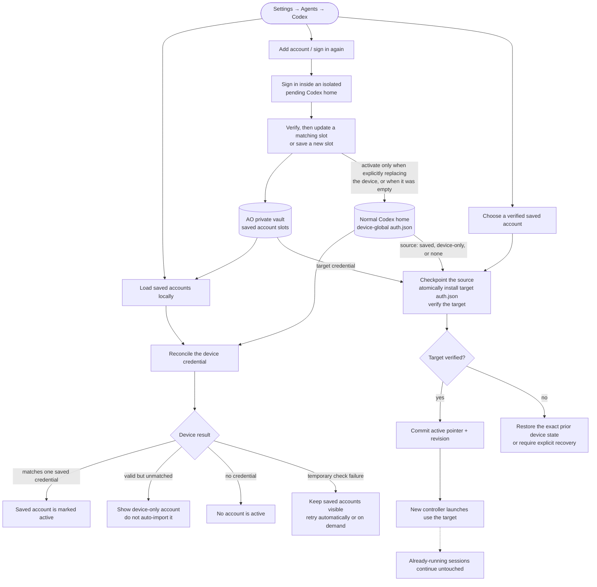

# Codex Account Management at a Glance

Branch snapshot: `codex/remove-legacy-account-session-restart`.

AO can save several Codex accounts, but Codex still uses one device-global
credential from its normal home. Account management lives in **Settings →
Agents → Codex**; there is no per-task account selector.

## How account management works

- Local account-store loading is separate from device reconciliation. A
  temporary Codex/provider failure does not hide the saved account list.
- Reconciliation classifies the device as a saved AO account, an unmatched
  device-only account, signed out, temporarily unavailable, or blocked. It uses
  exact credential-file identity before associating provider results with a
  saved slot.
- An unmatched external login remains an ephemeral device-only account. The
  user must explicitly sign it in through AO to save it, or switch to an
  already-saved account.
- Add account uses an isolated login home. A verified login updates the newest
  matching saved identity instead of creating a duplicate; otherwise it creates
  a new private slot. It changes the device account only when the device was
  empty or the user explicitly chose device sign-in.
- Signing out an active saved account also signs the device out. Delete signs
  out first when needed, then removes the now-inactive saved slot.

## How switching works

- The target must be a verified saved account. The source may be a saved
  account, an unmatched device-only credential, or no credential at all.
- The switch is a durable, idempotent credential transaction: validate the
  revision, checkpoint the exact source, atomically install the target, verify
  it through the normal Codex home, then commit the active pointer.
- Account switching does not enumerate, fence, interrupt, stop, or resume
  sessions and reviewers. Already-running controllers continue untouched; new
  controller launches use the selected account.
- A user can manually restart or resume an existing session when they want its
  controller relaunched under the active account.
- On failure, AO restores the exact previous saved/device-only/signed-out state
  when it can prove that is safe; otherwise the credential operation remains
  fenced for explicit recovery.
